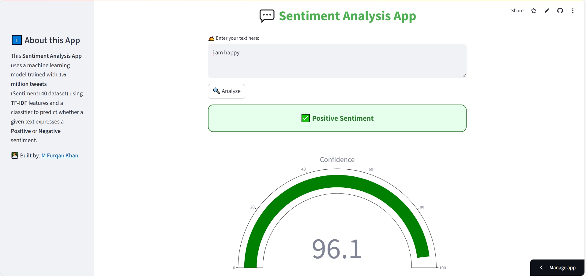

# 💬 Tweet Sentiment Analyzer  

A **Streamlit-based Sentiment Analysis app** trained on **1.6 million tweets (Sentiment140 dataset)** using **TF-IDF + Machine Learning**.  
This app predicts whether a given text expresses a **Positive 😊** or **Negative 😡** sentiment, with an interactive and user-friendly UI.  

---

## 🚀 Features  
- 📝 Input any text or tweet to analyze sentiment  
- 📊 Trained on **1.6M tweets (Sentiment140 dataset)**  
- 🔎 Uses **TF-IDF vectorization** + ML classifier  
- 🎨 Modern UI with styled results & confidence score  
- 📈 Interactive gauge chart to visualize prediction confidence  
- 🌐 Built with **Streamlit** for easy deployment  

---

## 📂 Dataset  
The model is trained on the **[Sentiment140 dataset](https://www.kaggle.com/datasets/kazanova/sentiment140)**,  
containing **1.6 million tweets** labeled as **positive** or **negative**.  

---

## 🛠️ Installation & Setup  

Clone the repository:  
```bash
git clone https://github.com/furqank73/tweet-sentiment-analyzer.git
cd tweet-sentiment-analyzer
````

Install dependencies:

```bash
pip install -r requirements.txt
```

Run the app:

```bash
streamlit run app.py
```

---

## App

🔹 **Live App on streamlit**
*([you can check the app here ](https://tweet-sentiment-analyzer-fk.streamlit.app/))*

🔹 **Prediction Example**
*()*

---

## 🧠 Model Details

* **Vectorizer:** TF-IDF (character n-grams)
* **Algorithm:** Logistic Regression classifier (or your actual classifier)
* **Trained on:** 1.6M tweets from Sentiment140 dataset

---

## 📌 Usage

* Enter any text in the input box
* Click **Analyze**
* Get instant **Positive / Negative** prediction with confidence score

---

## 🙋 About the Author

👨‍💻 Developed by **M Furqan Khan**

* [GitHub](https://github.com/furqank73)
* [Kaggle](https://www.kaggle.com/fkgaming)
* [LinkedIn](https://www.linkedin.com/in/furqan-khan-256798268/)

---

## ⭐ Contribute

Contributions are welcome!
If you’d like to improve this project, feel free to **fork** the repo and submit a **pull request**.

---
